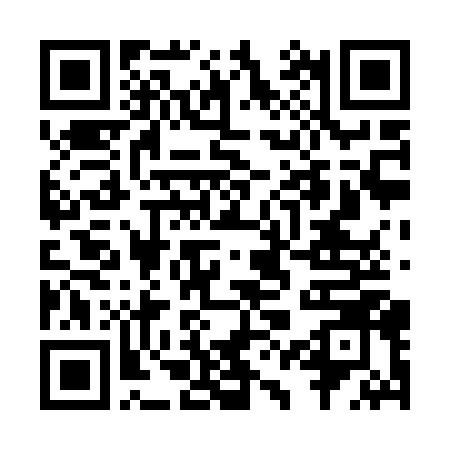

# LDDisplay PC 컨트롤 프로그램 (Windows)

시리얼 통신용 Windows 실행 파일. Python으로 개발돼 컴파일된 단일 exe.

## 파일

- **[`LDDisplayControl_v0.3.0.exe`](LDDisplayControl_v0.3.0.exe)** — 메인 실행 파일 (8.6 MB, 설치 불필요)
- **[사용설명서 (v0.3.0)](%5B%EB%B0%B0%ED%8F%AC%5DLDDisplay-%EC%84%A4%EC%A0%95%ED%94%84%EB%A1%9C%EA%B7%B8%EB%9E%A8%EC%82%AC%EC%9A%A9%EC%84%A4%EB%AA%85%EC%84%9C_%EA%B8%B0%EB%B3%B8_v0.3.0.html)** — HTML 매뉴얼 (프로그램 다운로드 QR 포함)

## 다운로드 QR



폰 카메라로 스캔 → 폰 브라우저로 URL 열리고, 링크를 PC에 공유해서 다운로드.

## 실행 방법

1. `LDDisplayControl_v0.3.0.exe` 다운로드
2. 더블클릭으로 실행
   - Windows SmartScreen 경고가 뜰 수 있음 → "추가 정보" → "실행" 선택
3. 포트 선택 → 연결

## 다운로드 링크

```
https://github.com/DainGisul/dain_dist/raw/main/forPC/LDDisplayControl_v0.3.0.exe
```

## 요구 사항

- Windows 10 이상 (권장)
- USB 케이블
- CH340 등 시리얼 드라이버 (설치 안 돼 있으면 [WCH 공식 페이지](https://www.wch.cn/downloads/CH341SER_ZIP.html)에서 다운로드)
